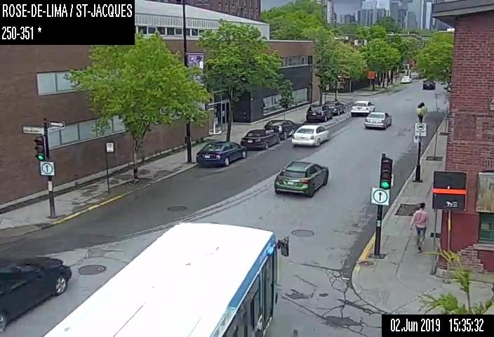
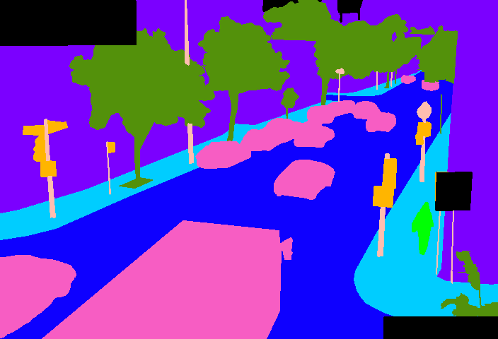
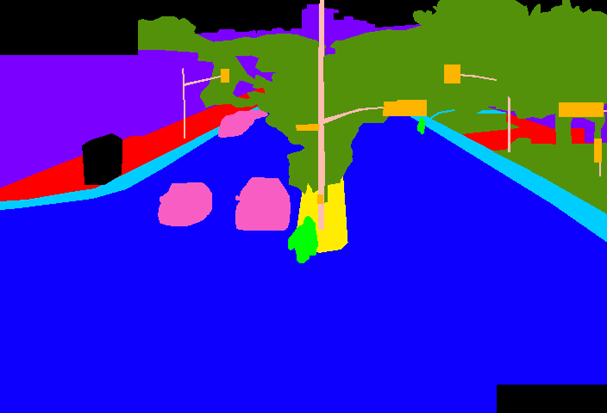
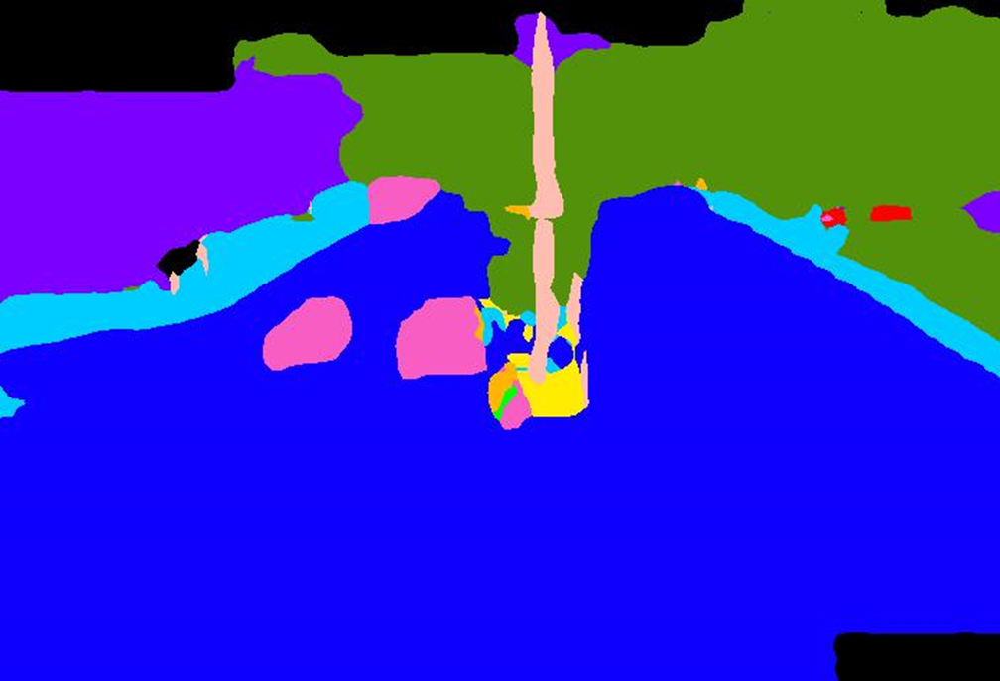
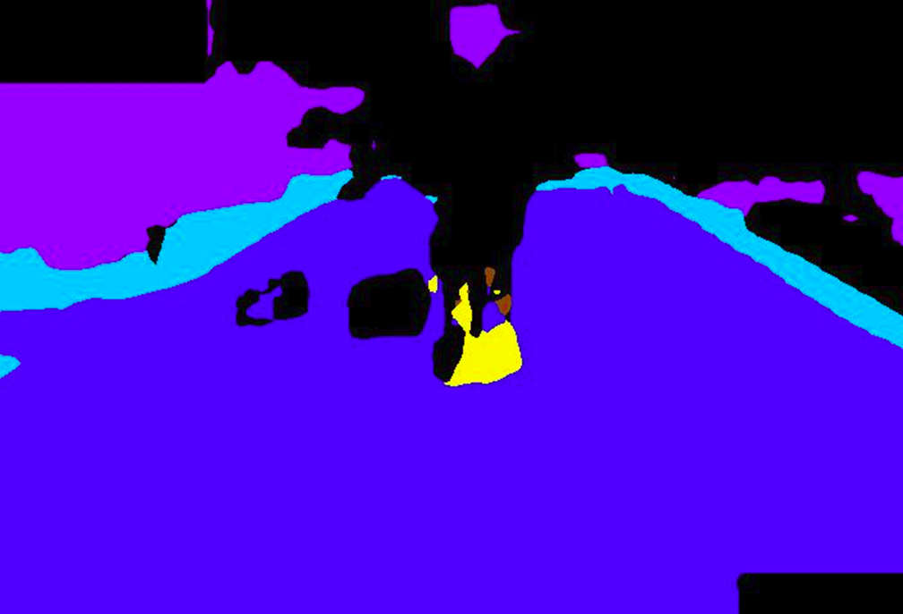
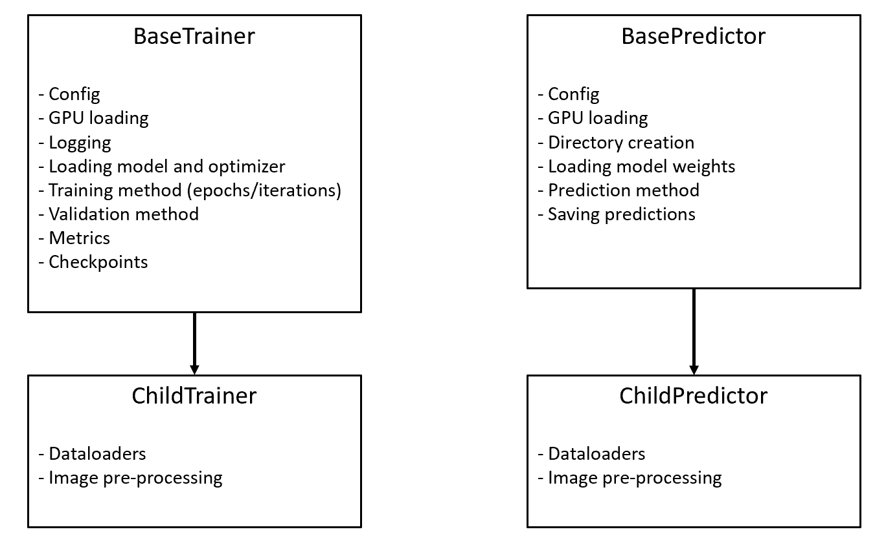

([Français](#french-version))

<a id='english-version' class='anchor' aria-hidden='true'/>

# Urban Segmentation

As part of a second cycle internship in machine learning at [MILA](https://mila.quebec/en/), the City of Montreal developed a prototype to generate
semantic segmentation of frames from a live video feed sourced on Pan-Tilt-Zoom (PTZ) traffic cameras.

We are publishing the results of this work by making available :

  - all the **annotated images** taken from the video stream of the traffic cameras and
  - the **code** developed as a proof of concept for the application of semantic segmentation methods in urban settings.

The code made available is **NOT production ready** and is not maintained to that end. It is a prototype that will evolve, 
in the medium-long term, to be part of a mature system.

### Context
The [Centre de Mobilité Urbaine](http://www1.ville.montreal.qc.ca/banque311/content/centre-de-gestion-de-la-mobilit%C3%A9-urbaine-cgmu) (CGMU) is the heart and brain of intelligent transport systems in Montreal. On a daily basis, the CGMU is a
real-time decision-making centre that aims to facilitate
the mobility of citizens and visitors. Specialized equipment makes it possible to remotely manage traffic on the road
network and to react quickly when an incident occurs. There are, among others, over [500 traffic cameras](https://donnees.montreal.ca/ville-de-montreal/cameras-observation-routiere) installed on the
territory that help operators quickly detect road obstacles.

In order to support the work of CGMU operators, the City of Montreal wishes to set up an automatic road anomaly
detection system. This system, based on artificial intelligence, will analyze in real time the video streams
coming from the 500 cameras in order to detect various types of incidents (an accident, a double parked vehicle
or a broken-down vehicle, etc.).

We have opted for an iterative approach aimed at developing a series of proofs of concept
that we can test and integrate as the developments progress. We have chosen a modular architecture where the outputs of some models could supply the inputs of other
models. The purpose of this modularity is to provide flexibility in the use of the models and to integrate them in
contexts other than traffic and with cameras other than those available at the CGMU. A first step was taken
in this direction by developing semantic segmentation models of images captured by CGMU cameras in an urban context.

### Semantic Segmentation
To detect a road anomaly, you must first be able to automatically recognize the different elements that make
up an image. For operational reasons, the CGMU's cameras are mobile (PTZ type). Therefore, the composition and position of the elements
of the images captured by these cameras constantly change. This prototype aims at using semantic segmentation to generate masks,
areas of interest, and possibly to identify the direction a camera is pointing without even knowing its metadata. The models implemented classify each pixel of an image as part of one of the following classes: roads, sidewalks, median strip, vegetation, traffic signs (including traffic lights), pole, construction object (e.g. cone) , buildings, structure (e.g. a bridge), private land, pedestrian, vehicle (including bicycle) and void (everything else).

The following image is taken from the 10 000 annotated images we used to train the models.


<p align="center">
  
  
</p>

You can find the annotated dataset on the City of Montreal's [open data site](https://donnees.montreal.ca/ville-de-montreal/images-annotees-cameras-circulation). 
Follow the link and along with the data, you will find a data dictionary (with semantic tags and their colour), the methodology applied to annotate data, the terms of use, etc.

It is important to note that the images we used for this project are taken from images already published on the [open data site](https://ville.montreal.qc.ca/circulation/). We made sure this data/code opening process respects the privacy of citizens. As these cameras are installed to assist CGMU operators in their traffic management, they are tuned to limit the information collected. They are therefore adjusted so that they cannot capture the faces nor the license plates. Also, even if we were able to identify a vehicle or a person (e.g. the clothes worn), it would not be possible to track its movements because the images are kept and published only at 5-minute intervals.

### Models
The code includes 3 semantic segmentation models, each one implemented with PyTorch. Although multiple implementations of these models already
exist, we decided to re-implement them for a better integration with the code base. These implementations are based on
our understanding of the initial papers. The models implemented are :

| Model | Publication |
|-|-|
| Segnet | Badrinarayanan, Vijay, Alex Kendall, and Roberto Cipolla. "[Segnet: A deep convolutional encoder-decoder architecture for image segmentation](https://ieeexplore.ieee.org/stamp/stamp.jsp?arnumber=7803544)." IEEE transactions on pattern analysis and machine intelligence 39.12 (2017): 2481-2495. |
| Fast-SCNN | Poudel, Rudra PK, Stephan Liwicki, and Roberto Cipolla. "[Fast-scnn: Fast semantic segmentation network].(https://arxiv.org/pdf/1902.04502.pdf)" arXiv preprint arXiv:1902.04502 (2019). |
| Adversarial Learning for Semi-supervised Semantic Segmentation  | Hung, Wei-Chih, et al. "[Adversarial learning for semi-supervised semantic segmentation](https://arxiv.org/pdf/1802.07934.pdf)." arXiv preprint arXiv:1802.07934 (2018). |

After several tests and refinements, we have focused the scope on the segmentation of the urban fabric and have eliminated 
classes that are dynamic or contain objects that
are too small (such as pedestrians, vehicles and vegetation). The objective of segmentation is therefore to determine
the static urban context at all times, i.e. determine which pixels are part of the following classes: median strip, sidewalks, 
roads, buildings, structure and void. The detection of dynamic objects will be carried out as part of another proof of concept. 
It was also found that performance can be improved by splitting images based on their resolution : small and large. Indeed, the 
lower-resolution images tend to decrease the overall performance.

The best results were obtained with the semi-supervised model with high-resolution images. Details about the models and 
performances can be found in Saber Benchalel's internship report.

As an example, the images below compare the results of the classification performed by the semi-supervised model (second 
segmentation is with all classes and third segmentation is limited to static classes) to the manual
annotation previously performed by a human (first image).

<p align="center">
  
  
  
</p>


## Requirements
The following packages were used at the specified version. Newer versions might not be compatible.

| Package       | Version    |
| :------------ |  --------: |
| torch         | 1.0.0      |
| torchvision   | 0.2.2      |
| tensorboardx  | 2.0        |
| mlflow        | 1.7.2      |
| opencv-python | 4.2.0.34   |
| hyperopt      | 0.2.4      |

## Config

Template configs are available under ```configs/template_semi.json``` and ```configs/template_supervised.json``` with explanations for each argument. The main sections are as follows:

  - name: The name given to the experiment. This is used to generate logs and predictions directories. This is also used 
  to differentiate between experiments with MLFLow.
  - semi: This boolean parameter is used to differentiate between a supervised and a semi-supervised config. Additional 
  options are needed if this is set to true.
  - seeds: The various fixed seeds used for reproducibility.
  - model: The name and parameters of the object used to create the model. The used model must be imported in ```models/__init__.py```.
  - optimizer: The name and parameters of the optimizer used to train the model. Built-in pytorch optimizers can be used.
  - trainer: The name and parameters of the object used to create a wrapper to train the model. The trainer must be imported in ```trainers/__init__.py```. Two basetrainer objects, ```BaseTrainer``` (supervised) and ```BaseTrainer_S``` (semi-supervised), contain the generic algorithm to train most models. Trainer objects must inherit from the adequate basetrainer and implement the required dataloaders.
  - predictor: The name and parameters of the object used to create a wrapper to generate predictions from a checkpoint. 
  The predictor must be imported in ```predictors/__init__.py```. The BasePredictor object contains the generic algorithm 
  to predict images. Predictor objects must inherit from ```BasePredictor``` and implement the required dataloaders.
  - hyperparam: A list of the hyperparameters. If ```finetune.py``` is used, a range must be specified.
  - data-dataloader: The parameters for the dataloader splits (train/valid/test).
  - data-dataset: The parameters for the dataset, its location and various built-in pre-processing methods.

### Additional arguments when semi-supervised
  - model_d: The name and parameters of the object used to create the discriminant model. The model must be imported in ```models/__init__.py```.
  - optimizer_d: The name and parameters of the optimizer used to train the discriminant model. Built-in pytorch optimizers can be used.
  - data-dataloader-extra: The parameters for the unsupervised extra dataloader.

Additionally, different trainer arguments and hyperparameters are needed when using the semi-supervised wrappers. See 
the template configs for an extensive list.




## Dataset

The dataset directory and file hierarchy must respect the following structure:
```
UrbanSegmentation
└──Images
   └──'Dataset_Name'
      ├──RGB
      │  ├──train
      |  |  ├──'filename_img1'
      |  |  ├──'filename_img2'
      |  |  └──...
      |  |
      │  ├──val
      │  ├──test
      │  └──extra
      |
      └──Semantic
         ├──train
         |  ├──'filename_img1'
         |  ├──'filename_img2'
         |  └──...
         |
         ├──val
         └──test
```
Some key points to keep in mind:

 - The images contained in ```RGB``` are used as inputs to the models. The images contained in ```Semantic``` are used as targets.
 - Images in ```RGB``` and their equivalent in ```Semantic``` must have the same name, but may use different image file formats (png, jpg, tiff, etc.).
 - Images > 'Dataset_Name' > RGB > extra is only required for semi-supervised training.
 - Images (RGB and semantic) are available on the [open data site](https://donnees.montreal.ca/ville-de-montreal/images-annotees-cameras-circulation).
     - The data is published divided into 2 datasets : RGB and Semantic. It is not divided into train/val/test splits. The file ```split.csv``` provides the splits to reproduce the experiments.
     - The ```split.csv``` file also provides the small/large split based on image resolution.
     - The images used for the semi-supervised training (aimed for the ```extra``` directory) are not available yet. In the mean time, images can be acquired from the [open data site](https://ville.montreal.qc.ca/circulation/).


## Single Experiment Training

```python train.py -c 'configs/any_config.json' -d 'path_to_savedir'```

  - -c, --config: Path to config file<br>
  - -r, --resume: Path to checkpoint<br>
  - -d, --dir: Path to save experiment<br>
All arguments are optional, but at least one of -c and -r must be used

## Hyperparameter Tuning

```python finetune.py -c 'configs/any_config.json' -d 'path_to_savedir'```

  - -c, --config: Path to config file<br>
  - -r, --resume: Path to checkpoint<br>
  - -d, --dir: Path to save experiment<br>
  - -t, --trials: Path to saved hyperopt Trials file<br>
All arguments are optional, but at least one of -c and -r must be used

## Inference from Checkpoint

```python predict.py -c 'logs/path_to_checkpoint.pth' -d 'path_to_savedir'```

  - -c, --checkpoint: Path to config file<br>
  - -d, --dir: Path to save experiment (optional) <br>

The images used as inputs are listed in the file specified by the config, under ```data > dataset > prediction_list```.
The config that was used is generally saved in the directory where the checkpoint is found. This config is used for reference,
but the config that is used is found by loading the checkpoint and inspecting ```checkpoint['config']```.

For convenience, we provide 5 pre-trained models in *Releases*. They have been trained as described in the report:

  - fs_cgmul_static_acc.pth : Semi-supervised + Fast-SCNN predictor, dataset : large images (CGMU_L), classes : only static.
  - fs_cgmus_static_acc.pth : Semi-supervised + Fast-SCNN predictor, dataset : small images (CGMU_S), classes : only static.
  - fs_cgmu_semi_acc.pth : Semi-supervised  + Fast-SCNN predictor, dataset : small and large images (CGMU_S+CGMU_L), classes : all.
  - fs_cgmu_sm_acc.pth : Fast-SCNN predictor, dataset : small and large images (CGMU_S+CGMU_L), classes : all.
  - fs_cgmu_l_acc.pth : Fast-SCNN predictor, dataset : large images (CGMU_L), classes : all.

These models can be used for inference without training. However, it requires to have the dataset directory and file hierarchy
in place. Since it is for inference only, the directories under ```Semantic``` can be empty.


### License

The source code of this project is distributed under the [MIT License](LICENSE).

### Contributing

See [CONTRIBUTING.md](CONTRIBUTING.md#english-version). Please note that the code is not production ready and is not 
maintained to that end.

### Code of Conduct

Participation in this project is governed by the [Code of Conduct](CODE_OF_CONDUCT.md).

______________________

([English](#english-version))

<a id='french-version' class='anchor' aria-hidden='true'/>

# Segmentation Urbaine
Dans le cadre d'un stage de deuxième cycle en apprentissage automatique à [MILA](https://mila.quebec/fr/), la Ville de 
Montréal a développé un prototype de segmentation sémantique en milieu urbain.  Le prototype segmente des images provenant 
d'un flux vidéo provenant de caméras de circulation de type Pan-Tilt-Zoom (PTZ).

Nous publions les résultats de ce travail en mettant à disposition:

  - les **images annotées** issues de flux vidéo des caméras de circulation et
  - le **code** de la preuve de concept de segmentation sémantique en milieu urbain.

Le code mis à disposition n'est **PAS prêt pour la production** et n'est pas maintenu dans cette optique. C'est un 
prototype qui, à moyen long terme, contribuera un système mature.

### Contexte
Le [Centre de Mobilité Urbaine](http://www1.ville.montreal.qc.ca/banque311/content/centre-de-gestion-de-la-mobilit%C3%A9-urbaine-cgmu) (CGMU) 
se veut le cœur et le cerveau des systèmes de transport intelligents à Montréal, avec comme objectif d'accélérer 
leur implantation en territoire montréalais. Il est un centre de prise de décisions en temps réel qui vise à faciliter 
la mobilité des citoyens et des visiteurs. L'équipement spécialisé dont il dispose permet de gérer à distance la 
circulation sur le réseau routier et de réagir rapidement lorsqu’un incident survient. On y dénombre, entre autres, 
[500 caméras de circulation](https://donnees.montreal.ca/ville-de-montreal/cameras-observation-routiere) 
installées sur le territoire qui aident les opérateurs à détecter rapidement les entraves routières.

Afin d’épauler le travail des opérateurs du CGMU, la Ville de Montréal souhaite mettre en place un système de 
détection automatique d’anomalies routières. Ce système reposera sur l’intelligence artificielle pour analyser 
en temps réel les flux vidéos provenant des 500 caméras afin d’y détecter divers types d’incidents (ex.: un accident, 
un véhicule garé en double ou un véhicule en panne).

Nous avons opté pour une approche itérative visant à développer une série de preuves de concept que nous pourrons tester 
et intégrer au fur et à mesure des développements. Nous avons choisi une architecture modulaire où les extrants de 
certains modèles pourraient fournir les intrants d’autres modèles. Cette modularité a pour but d’apporter une flexibilité 
dans l’utilisation des modèles et les intégrer dans d’autres contextes que celui de la circulation et avec d’autres caméras 
que celles disponibles au CGMU. Un premier pas a été fait dans cette direction en développant un modèle de segmentation 
sémantique des images  captées par les caméras du CGMU en contexte urbain.


### Segmentation sémantique
Pour être en mesure de détecter une anomalie routière, il faut d’abord pouvoir reconnaître de façon automatique les différents 
éléments qui composent une image. Pour des raisons opérationnelles, les caméras du CGMU étant mobiles (PTZ), la composition 
ainsi que la position des éléments des images captées par ces caméras changent constamment. Il est donc nécessaire de pouvoir 
définir le contexte urbain en tout temps. La segmentation sémantique sert donc à classifier chaque pixel d’une image. 
En se basant sur les besoins de la Ville, nous avions initialement défini 13 classes : voie, trottoir, terre-plein, 
végétation, panneaux de signalisation (incluant les feux), poteaux, objets de construction (ex.: les cônes), les bâtiments, 
structures (ex.: un pont), terrains privés, piétons, véhicules (incluant les vélos) et néant (pour tout ce qui ne ne fait 
pas partie des 12 autres classes, comme le ciel par exemple). Ce prototype vise à utiliser la segmentation sémantique pour
 générer des masques, des zones d’intérêt et éventuellement pour identifier la direction vers laquelle pointe une caméra sans même 
connaître ses métadonnées. 


L'image suivante est tirée des 10 000 images annotées que nous avons utilisées pour entraîner les modèles.

<p align="center">
  
  
</p>

Vous pouvez trouver l'ensemble de données annotées sur le [site de données ouvertes] de la Ville de 
Montréal (https://donnees.montreal.ca/ville-de-montreal/images-annotees-cameras-circulation). Suivez le lien et vous trouverez, en plus des données, un dictionnaire 
de données (avec les balises sémantiques et leur couleur), la méthodologie appliquée pour annoter les données, 
les conditions d'utilisation et la licence.

Il est important de souligner que les images que nous avons utilisées dans le cadre de ce projet sont tirées 
des images déjà publiées sur le [site de données ouvertes] (https://ville.montreal.qc.ca/circulation/). De ce fait, 
nous nous sommes assurés dans le cadre de l’ouverture de ces données de respecter la vie privée de nos citoyens. 
Comme ces caméras sont installées pour aider 
les opérateurs du CGMU dans leur gestion de la circulation, elles sont ajustées pour limiter l’information recueillie. 
Elles sont donc ajustées de façon à ne pas pouvoir capter les visages ni les plaques d’immatriculations des véhicules. 
Aussi, même si on arrivait à identifier un véhicule ou une personne par sa couleur ou les vêtements portés, il ne serait 
pas possible de suivre ses déplacements, car les images sont conservées et publiées uniquement à chaque intervalle 
de 5 minutes.

### Modèles
Le code comprend 3 modèles de segmentation sémantique, chacun implémenté avec PyTorch. Bien qu'il existe plusieurs implémentations 
de ces modèles, nous avons décidé de les réimplémenter pour une meilleure intégration avec la base de code. Ces 
implémentations sont basées sur notre compréhension des articles initiaux décrivant ces modèles. Les modèles mis en oeuvre sont:

| Modèle | Article |
|-|-|
| Segnet | Badrinarayanan, Vijay, Alex Kendall, and Roberto Cipolla. "[Segnet: A deep convolutional encoder-decoder architecture for image segmentation](https://ieeexplore.ieee.org/stamp/stamp.jsp?arnumber=7803544)." IEEE transactions on pattern analysis and machine intelligence 39.12 (2017): 2481-2495. |
| Fast-SCNN | Poudel, Rudra PK, Stephan Liwicki, and Roberto Cipolla. "[Fast-scnn: Fast semantic segmentation network].(https://arxiv.org/pdf/1902.04502.pdf)" arXiv preprint arXiv:1902.04502 (2019). |
| Adversarial Learning for Semi-supervised Semantic Segmentation  | Hung, Wei-Chih, et al. "[Adversarial learning for semi-supervised semantic segmentation](https://arxiv.org/pdf/1802.07934.pdf)." arXiv preprint arXiv:1802.07934 (2018). |


Après plusieurs tests et raffinements, nous avons concentré la portée du modèle à la segmentation de la trame urbaine et 
avons éliminé les classes d’entités dynamiques ou contenant des objets trop petits (soit les piétons, les véhicules et 
la végétation). La segmentation a donc comme objectif de déterminer le contexte urbain statique en tout temps (nous 
sommes donc passé de 13 à 6 classes: terre-pleins, trottoirs, voies, bâtiments, structures et néant). La détection des 
objets dynamiques sera réalisée dans le cadre d’une autre preuve de concept (présentement en cours).
Nous avons également été constaté que les performances peuvent être améliorées en divisant les images en 
fonction de leur résolution: petite et grande. En effet, les images à basse résolution ont tendance à diminuer les 
performances globales.

Les meilleurs résultats ont été obtenus avec le modèle semi-supervisé pour les images en haute résolution. Les détails sur 
les modèles et les performances se trouvent dans le rapport de stage de Saber Benchalel.

En guise d’exemple, les images ci-dessous comparent les résultats de la classification effectuée par le modèle (la deuxième 
segmentation est avec toutes les classes et la troisième est limitée aux classes statiques) à 
l’annotation manuelle effectuée au préalable par un humain (première image).

<p align="center">
  
  
  
</p>

## Requis

Les *packages* suivants ont été utilisés dans la version spécifiée. Les versions plus récentes pourraient ne pas être compatibles.

| Package       | Version    |
| :------------ |  --------: |
| torch         | 1.0.0      |
| torchvision   | 0.2.2      |
| tensorboardx  | 2.0        |
| mlflow        | 1.7.2      |
| opencv-python | 4.2.0.34   |
| hyperopt      | 0.2.4      |


## Configuration
Les configurations de modèle sont disponibles sous  ```configs/template_semi.json``` et ```configs/template_supervised.json``` 
avec des explications pour chaque argument. Les principales sections sont les suivantes:

  - name: Le nom donné à l'expérience. Ceci est utilisé pour générer des journaux et des répertoires de prédictions. 
  Ceci est également utilisé pour différencier les expériences avec MLFLow.
  - semi: Ce paramètre booléen est utilisé pour différencier une configuration supervisée et semi-supervisée. 
Des options additionnelles sont nécessaires si ce paramètre est défini à *true*.
  - seeds: Les différents *seeds* fixes utilisés pour la reproductibilité.
  - model: Le nom et les paramètres de l'objet utilisé pour créer le modèle. Le modèle utilisé doit être importé 
  dans ```models/__init__.py```.
  - optimizer: le nom et les paramètres de l'optimiseur utilisé pour entraîner le modèle. Des optimiseurs pytorch 
  intégrés peuvent être utilisés.
  - trainer: Le nom et les paramètres de l'objet utilisé pour créer un wrapper pour entraîner le modèle. Le *trainer* 
  doit être importé dans ```trainers/__init__.py```. Deux objets de type *basetrainer*, ```BaseTrainer``` (supervisé) et
    ```BaseTrainer_S``` (semi-supervisé), contiennent l'algorithme générique pour entraîner la plupart des modèles. 
    Les objets du *trainer* doivent hériter du *basetrainer* adéquat et implémenter les *dataloaders* requis. 
  - predictor: Le nom et les paramètres de l'objet utilisé pour créer un wrapper pour générer des prédictions à partir 
  d'un point de contrôle. Le prédicteur doit être importé dans ```predictors/__init__.py```. L'objet BasePredictor contient 
  l'algorithme générique pour prédire les images. Les objets *Predictor* doivent hériter de ```BasePredictor``` et 
  implémenter les *dataloaders* requis.
  - hyperparam: une liste des hyperparamètres. Si ```finetune.py``` est utilisé, une plage de valeurs doit être spécifiée.
  - data-dataloader: Les paramètres pour les *splits* de dataloader (train/valid/test).
  - data-dataset: Les paramètres de l'ensemble de données, son emplacement et diverses méthodes de prétraitement intégrées.

### Arguments supplémentaires en semi-supervision
  - model_d: Le nom et les paramètres de l'objet utilisé pour créer le modèle discriminant. Le modèle doit être importé 
  dans ```models/__init__.py```.
  - optimizer_d: Le nom et les paramètres de l'optimiseur utilisé pour entraîner le modèle discriminant. 
  Des optimiseurs pytorch intégrés peuvent être utilisés.
  - data-dataloader-extra: Les paramètres du chargeur de données supplémentaire non supervisé.

De plus, différents arguments d'entraînement et hyperparamètres sont nécessaires lors de l'utilisation des wrappers 
semi-supervisés. Voir les fichiers de type ```configs/template_``` pour une liste complète.


## Ensemble de données

Le répertoire de l'ensemble de données et la hiérarchie des fichiers doivent respecter la structure suivante:
```
UrbanSegmentation
└──Images
   └──'Dataset_Name'
      ├──RGB
      │  ├──train
      |  |  ├──'filename_img1'
      |  |  ├──'filename_img2'
      |  |  └──...
      |  |
      │  ├──val
      │  ├──test
      │  └──extra
      |
      └──Semantic
         ├──train
         |  ├──'filename_img1'
         |  ├──'filename_img2'
         |  └──...
         |
         ├──val
         └──test
```
Quelques points clés à garder à l'esprit:

 - Les images contenues dans ```RGB``` sont utilisées comme entrées dans les modèles. Les images contenues dans 
 ```Semantic``` sont utilisées comme cibles.
 - Les images ```RGB``` et leur équivalent dans ```Semantic``` doivent avoir le même nom, mais peuvent utiliser différents 
 formats de fichiers images (png, jpg, tiff, etc.).
 - Images > 'Dataset_Name' > RGB > extra n'est requis que pour l'entraînement semi-supervisée.
 - Les images (RGB et sémantique) sont disponibles sur le [site des données ouvertes](https://donnees.montreal.ca/ville-de-montreal/images-annotees-cameras-circulation).
     - Les données sont publiées divisées en 2 jeux de données : RGB et Sémantique.  Il n'est pas divisé 
     en train/val/test. Le fichier ```split.csv``` fournit les splits pour reproduire les expériences.
     - Le fichier  ```split.csv``` fournit également la petite/grande division basée sur la résolution de l'image.
     - Les images utilisées pour la formation semi-supervisée (destinée au répertoire ```extra``` ) ne sont pas encore 
     disponibles. En attendant, les images peuvent être acquises à partir du [site de données ouvertes](https://ville.montreal.qc.ca/circulation/).
     
 ## Entrainement (expérience unique)

```python train.py -c 'configs/any_config.json' -d 'path_to_savedir'```

  - -c, --config: Chemin vers le fichier de configuration<br>
  - -r, --resume: Chemin vers le fichier de *checkpoint*<br>
  - -d, --dir: Chemin vers le répertoire de sauvegarde de l'expérience <br>
Tous les arguments sont facultatifs à l'exception de -c ou -r 

## Réglage des hyperparamètres

```python finetune.py -c 'configs/any_config.json' -d 'path_to_savedir'```

  - -c, --config: Chemin vers le fichier de configuration<br>
  - -r, --resume: Chemin vers le fichier de *checkpoint*<br>
  - -d, --dir: Chemin vers le répertoire de sauvegarde de l'expérience<br>
  - -t, --trials: Chemin vers le fichier d'expériences *hyperopt Trials*<br>
Tous les arguments sont facultatifs à l'exception de -c ou -r. 

## Inférence à partir du *checkpoint*

```python predict.py -c 'logs/path_to_checkpoint.pth' -d 'path_to_savedir'```

  - -c, --checkpoint: Chemin vers le fichier de configuration<br>
  - -d, --dir: Chemin vers le répertoire de sauvegarde de l'expérience (optionel) <br>

Les images utilisées comme intrants sont répertoriées dans le fichier spécifié dans la configuration, sous 
```data> dataset> prediction_list```.
La configuration utilisée est généralement enregistrée dans le répertoire où se trouve le *checkpoint*. Cette configuration 
est utilisée comme référence, mais la configuration utilisée est accessible en chargeant le *checkpoint* et 
en inspectant ```checkpoint ['config']```.

Pour plus de commodité, nous libérons 5 modèles préentraînés dans *Releases*. Ils ont été entraînés comme décrit dans 
le rapport:

  - fs_cgmul_static_acc.pth : Semi-supervisé + prédicteur Fast-SCNN, ensemble de données : grandes images (CGMU_L), classes : statiques uniquement.
  - fs_cgmus_static_acc.pth : Semi-supervisé + prédicteur Fast-SCNN, ensemble de données : petites images (CGMU_S), classes : statiques uniquement.
  - fs_cgmu_semi_acc.pth : Semi-supervisé  + prédicteur Fast-SCNN, ensemble de données : petites et grandes images (CGMU_S+CGMU_L), classes : toutes.
  - fs_cgmu_sm_acc.pth : prédicteur Fast-SCNN, ensemble de données : petites et grandes images (CGMU_S+CGMU_L), classes : toutes.
  - fs_cgmu_l_acc.pth : prédicteur Fast-SCNN, ensemble de données : grandes images (CGMU_L), classes : toutes.

Ces modèles peuvent être utilisés pour l'inférence sans entraînement. Cependant, il est nécessaire d'avoir le répertoire 
de l'ensemble de données et la hiérarchie des fichiers en place. Puisqu'il s'agit uniquement d'inférence, les répertoires 
sous ```Sémantique``` peuvent être vides.


### Contribuer

Voir [CONTRIBUTING.md](CONTRIBUTING.md#french-version). Le code mis à disposition n'est pas prêt pour la production 
et n'est pas maintenu dans cette optique.

### Licence et propriété intellectuelle

Le code source de ce projet est libéré sous la licence [MIT License](LICENSE).

### Code de Conduite

La participation à ce projet est réglementée part le [Code de Conduite](CODE_OF_CONDUCT.md#french-version)
